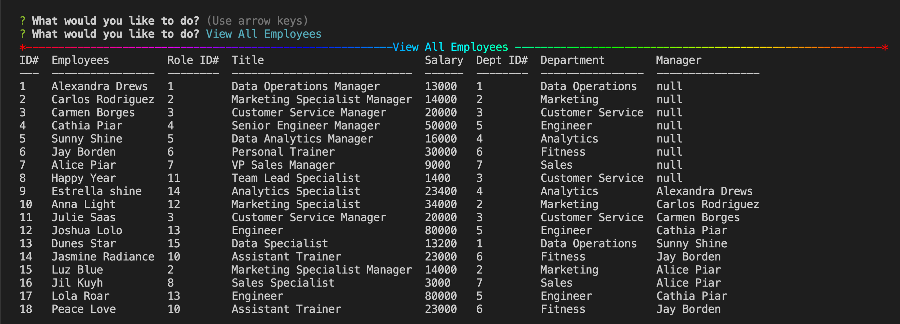
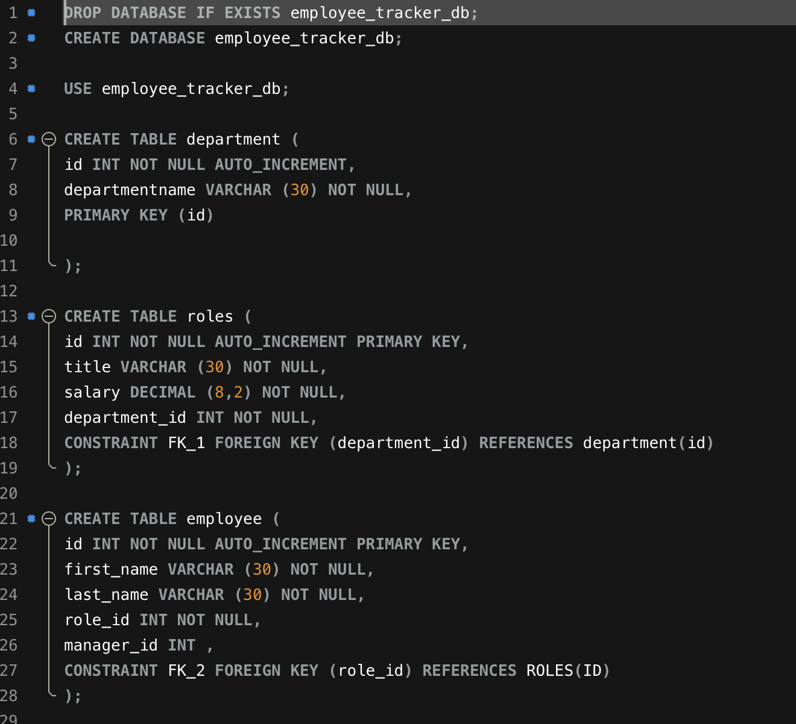
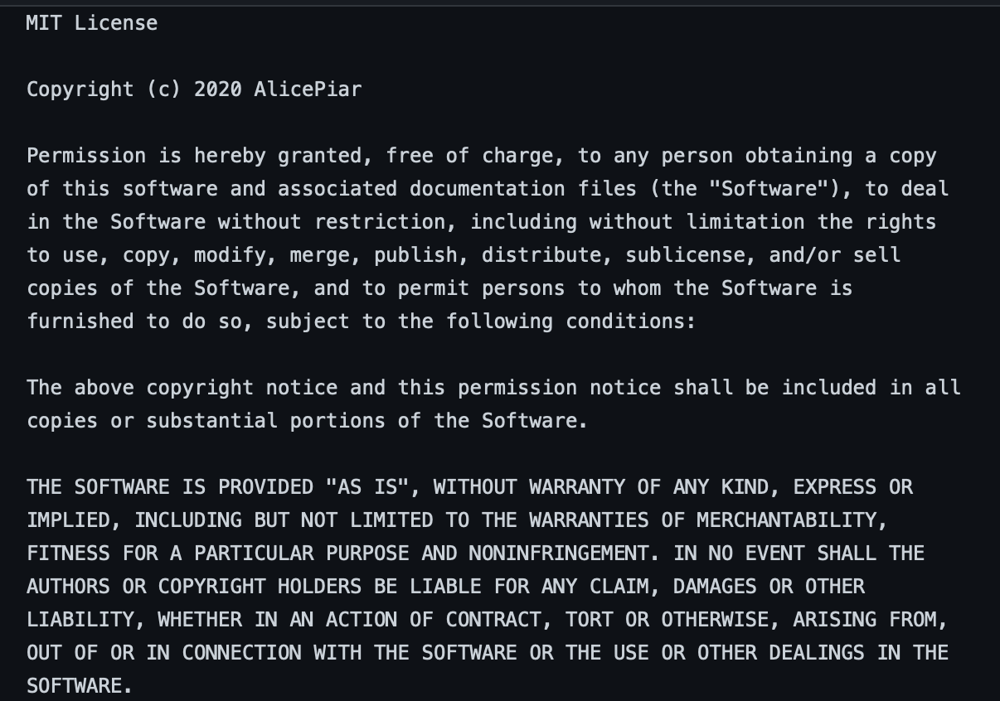

 # 


 


## :memo: Description:

Developers are often tasked with creating interfaces that make it easy for non-developers to view and interact with information stored in databases. Often these interfaces are known as Content Management Systems. In this homework assignment, your challenge is to architect and build a solution for managing a company's employees using node, inquirer, and MySQL.

`As a business owner`
`I want to be able to view and manage the departments, roles, and employees in my company`
`So that I can organize and plan my business`


### :camera: Visuals:

<br>
<br>
<br>
<br>


### :computer: Installation:

How do you deliver this? Here are some guidelines:

Use the ```MySQL NPM``` package to connect to your MySQL database and perform queries.

Use ```InquirerJs NPM package``` to interact with the user via the command-line.

Use ```console.table``` to print MySQL rows to the console. There is a built-in version of console.table, but the NPM package formats the data a little better for our purposes.

You may wish to have a separate file containing functions for performing specific SQL queries you'll need to use. Could a constructor function or a class be helpful for organizing these?

You will need to perform a variety of ```SQL JOINS``` to complete this assignment, and it's recommended you review the week's activities if you need a refresher on this.

- Terminal
- Visual Studio Code
- Git Lab
- GitHub
- MySQL Database
- npm init
- npm install
- npm asciiart

###  Usage:

``` node app.js```


### :wave: Contributing:

Pull requests are welcome. For major changes,<br>
please open an issue first to discuss what you would like to change.<br>
Please make sure to update tests as appropriate.


### :octocat: Profile:

[GitHub](https://github.com/adpir/Employee-Management-System)<br>

### :octocat: Project Videos
[Video](https://drive.google.com/file/d/1bVuzuA9LNYAws0Gb1KUapnc8roPo2n1R/view?usp=sharing)<br>
[Video-2](https://drive.google.com/file/d/1wWXsfO_E63Jm0iZVOWmXN1uC-pdnz6gz/view?usp=sharing)


### :copyright: License

<br>
[License](https://github.com/adpir/Employee-Management-System/blob/main/LICENSE) All rights reserved.
